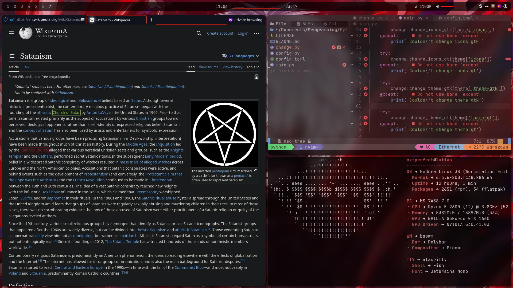

## My Fedora 38 dot files

### What's used
Terminal - Alacritty\
Font - JetBrains Mono\
Browser - Firefox\
Shell - Fish\
Editor - Nvchad\
Prompt - Starship\
Bar - Polybar\
Wallpaper - Feh\
Launcher - Rofi\
Misc - Tmux\

Tmux plugins
 - tmux-plugins/tpm
 - tmux-plugins/tmux-sensible
 - ChanderG/tmux-notify
 - ofirgall/tmux-window-name
 - dracula/tmux
 - tmux-plugins/tmux-sidebar
 - christoomey/vim-tmux-navigator
 - tmux-plugins/tmux-yank

